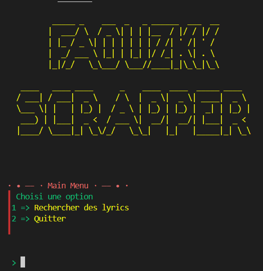

# Scraper de Paroles Letras

<p align = center>
    
</p>


## À propos

Ce projet est un scrapper développé en Python pour récupérer les paroles de chansons depuis le site **[Letras](https://www.letras.mus.br/)**. Il permet aux utilisateurs de rechercher facilement des paroles de chansons et de les afficher dans le terminal.

## Table des matières

- 🪧 [À propos](#à-propos)
- 📦 [Prérequis](#prérequis)
- 🚀 [Installation](#installation)
- 🛠️ [Utilisation](#utilisation)
- 🤝 [Contribution](#contribution)
- 🏗️ [Construit avec](#construit-avec)

## Prérequis

- **Python 3.x** : Assurez-vous d'avoir Python installé sur votre machine ou termux. Vous pouvez le télécharger depuis [python.org](https://www.python.org/downloads/).
- **Bibliothèques Python** : Le projet utilise plusieurs bibliothèques, dont `shutil`, `time`, `pyfiglet`, et `colorama`.

## Installation

1. Clonez le dépôt sur votre machine :

   ```bash
   git clone https://github.com/FaouzKK/letras-lyrics-scrapper-python lyric
   ```

2. Accédez au répertoire du projet :

   ```bash
   cd lyric
   ```

3. Installez les dépendances requises :

   ```bash
   pip install -r requirements.txt
   ```


## Installation sur Termux

Pour installer ce projet sur Termux, suivez ces étapes :

1. **Mettez à jour les paquets de Termux** :
   ```bash
   apt update && apt upgrade
   ```

2. **Installez Python et Git** :
   ```bash
   pkg install python git
   ```

3. **Clonez le dépôt** :
   ```bash
   git clone https://github.com/FaouzKK/letras-lyrics-scrapper-python lyric
   ```

4. **Accédez au répertoire du projet** :
   ```bash
   cd lyric
   ```

5. **Installez les dépendances** :
   ```bash
   pip install -r requirements.txt
   ```

6. **Exécutez le script** :
   ```bash
   python app.py
   ```

Assurez-vous d'avoir un accès Internet pour télécharger les dépendances et le dépôt.


## Utilisation

### Exécution du script

Pour utiliser le scrapper, exécutez le fichier `app.py` avec la commande suivante :

```bash
python app.py
```

Entrez le titre de la chanson lorsque cela est demandé. 


Les paroles de la chanson seront affichées dans le terminal.

## Contribution

### Comment contribuer

Si vous souhaitez contribuer à ce projet, veuillez suivre ces étapes :

1. Forkez le dépôt.
2. Créez une nouvelle branche pour votre fonctionnalité :

   ```bash
   git checkout -b ma-nouvelle-fonctionnalité
   ```

3. Apportez vos modifications et validez-les :

   ```bash
   git commit -m "Ajout d'une nouvelle fonctionnalité"
   ```

4. Poussez vos modifications sur votre fork :

   ```bash
   git push origin ma-nouvelle-fonctionnalité
   ```

5. Ouvrez une pull request.

## Construit avec

### Langages & Frameworks

- **Python** : Langage de programmation utilisé pour développer le scrapper. [Documentation Python](https://docs.python.org/3/)
